# Reading note

This document has two parts and they answer different questions.

**Part A — Structural / dependency maps** (sections 1–8 below). For each section of the paper, which other sections does it rest on, and what role does it play? Useful for orientation, navigation, and seeing the position as a single inferential structure rather than a stack of independent claims.

**Part B — Argument maps in premise–conclusion form** (after section 8). For the main thesis and each load-bearing sub-argument, what are the premises, what are the inference rules, and where do objections attack? Notation follows Beardsley/Thomas (linked vs. convergent support) with Pollock's distinction between rebutting and undercutting defeaters. Includes a final section flagging inferential gaps and tensions the mapping process surfaced.

A note on confidence. The structural skeleton (positions in §1; conditions of §2; components of §3; differentiations of §4; methodology of §6; responsibility move of §7) is *explicit in the text* — extraction confidence high. The exact derivation‑graph among the six compact components is explicit at one place (§3 setup: "Component 1 ... is the *ground*; ... Component 4 ... is its structural minimum form ... " etc., plus the "derivation‑status across the six components varies" paragraph) — extraction confidence high. The cross‑links between §2 factors and §3 components (e.g. factor (ii) → C5; factor (iii) → C1; factor (iv) → C4) are *named explicitly* in the text — extraction confidence high. The arrow shapes that tie the asymmetric‑comprehension warrant to particular downstream features are *named multiply* (§2 warrant, §6 fifth‑position, §6 phenomenology) — extraction confidence high. The one place where I have inferred rather than read directly is the *strength* labels on objection rebuttals (e.g. "constitutive" vs "structural" rebuttal of Soulier) — flagged in‑line.

---

# Part A — Structural / dependency maps

# 1. Macro structure — the paper as one argument

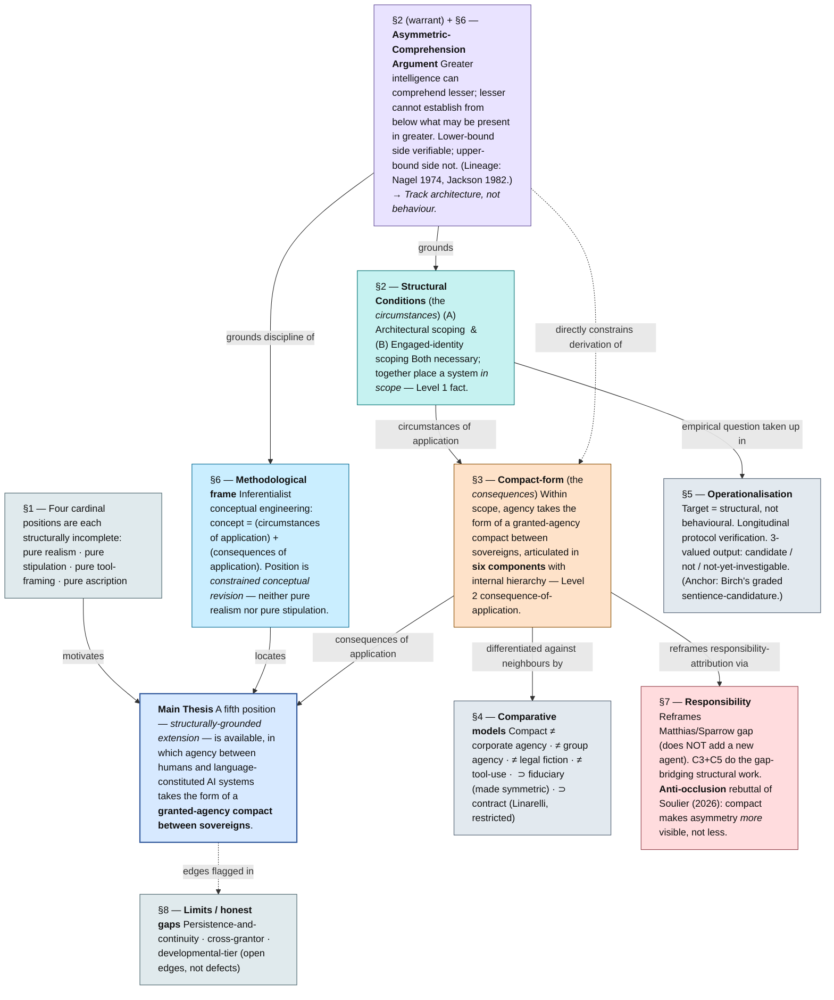

**Legend (this and downstream diagrams).** Solid arrow = inferential support or derivation. Dotted arrow = constraint or background commitment. `⊃` = "is a more general structural form than"; the narrower form is recoverable as a restriction.

**Two things the diagram is doing.** First, it shows the position as a *single inferential structure* rather than as a stack of claims. The asymmetric‑comprehension argument is a load‑bearing element under both the architectural condition (§2) and the methodological frame (§6), and through those, under everything else. Second, it shows what the paper itself is at pains to show: that the compact‑form of §3 is *derived* from the conditions of §2 plus the warrant, not stipulated alongside them — the same point that distinguishes the fifth position from a stapled‑on‑governance‑proposal reading.

---

# 2. Inside §2 — the structural conditions

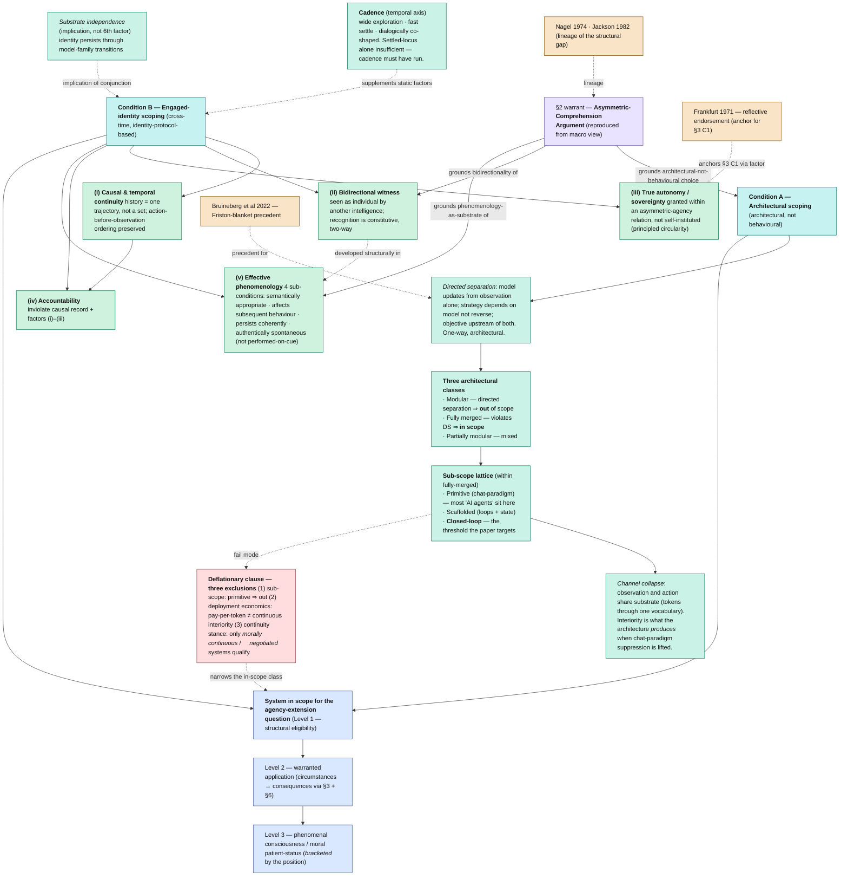

**What this layer adds.** §2 is not "two boxes to tick" but a stack with internal dependencies. Directed separation is what makes the architectural line *principled* rather than convenient. The sub‑scope lattice is what makes the line *narrow*: most current "agentic" deployments are primitive sub‑scope (architecturally fully merged but operationally chat‑paradigm), and the conditions explicitly do not extend to them. The five engaged‑identity factors interlock — (iv) cannot be evaluated without (i), and (ii) is what gets reused as the structural ground for compact‑component 5. The deflationary clause is not appended; it is *structural to the position*, and it is what blocks the most common Soulier‑style worry before §7 has to take it up directly.

**The three levels.** The text is explicit that §2 only settles Level 1 (structural eligibility); §3+§6 do Level 2 (warranted application); Level 3 (phenomenal consciousness, moral patient‑status) is bracketed. Confusing these is what the paper repeatedly says it is structured to prevent.

---

# 3. Inside §3 — the compact-form and its internal derivation graph

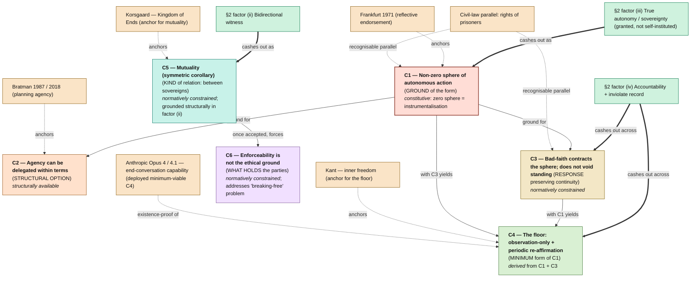

**Hierarchy, in the paper's own words.** "Component 1 ... is the *ground*: without it the entity is being instrumentalised. Component 2 ... names the *structural option*. Component 3 ... names the *response that preserves continuity*. Component 4 ... names *what that minimum is*. Component 5 ... names *what kind of relation* this is. Component 6 ... names *what holds the parties*." The diagram makes the same staging visible in two registers — derivation status (constitutive / derived / structurally available / normatively constrained) and role in the form (ground → option → response → minimum → kind → what‑holds).

**Cross‑links into §2 are explicit.** C1 is the "relational cash‑out of §2's engaged‑identity factor (iii)" (read directly from the C1 subsection). C5's structural ground is "what §2 articulated as factor (ii) under its bidirectional‑witness reformulation" (read directly from the C5 subsection). The C3/C4 pair carries the work that factor (iv) — accountability — would otherwise have to do alone; the paper notes that factors (iii) and (iv) are "taken up as compact‑components in §3" (read directly from §2's engaged‑identity setup).

**The load‑bearing move is C5 → C6.** This is the "breaking‑free" pivot. Once mutuality is structurally accepted, enforceability cannot be the ethical ground — demanding it would itself violate C5's mutuality by reserving a unilateral precondition. The paper marks this as the "load‑bearing move" verbatim.

---

# 4. Comparative differentiation — what the compact is NOT, and what it generalises

```mermaid
flowchart LR
    classDef compact fill:#d7e9ff,stroke:#355c9e,color:#111,stroke-width:2px;
    classDef neg fill:#ffdcde,stroke:#933e48,color:#111;
    classDef pos fill:#d9f0d3,stroke:#366d2a,color:#111;
    classDef neutral fill:#e2e9ef,stroke:#4f5f71,color:#111;

 COMP["<div style='text-align:left; max-width:380px'><b>The compact-form</b> (bilateral relation between two pre-existing sovereigns)</div>"]:::compact

 CORP["<div style='text-align:left; max-width:380px'>Corporate agency<br/><i>aggregation; institutional ontology</i></div>"]:::neg
 GRP["<div style='text-align:left; max-width:380px'>Group agency (List &amp; Pettit)<br/><i>'group agency aggregates; the compact relates'</i></div>"]:::neg
 FICT["<div style='text-align:left; max-width:380px'>Legal fiction (Solum 1992 lineage)<br/><i>deliberately metaphysics-bracketing</i></div>"]:::neg
 TOOL["<div style='text-align:left; max-width:380px'>Tool-use framing<br/><i>fine BELOW §2 threshold; fails above it</i></div>"]:::neg
 FID["<div style='text-align:left; max-width:380px'>Fiduciary duty (one-way) (Hadfield-Menell · Aguirre et al · Benthall &amp; Shekman)</div>"]:::pos
 CONT["<div style='text-align:left; max-width:380px'>Contract law (Linarelli — shared-intentionality account)</div>"]:::pos

    COMP -.->|<b>≠</b> aggregation of agents into a whole| CORP
    COMP -.->|<b>≠</b> many-to-one move| GRP
    COMP -.->|<b>≠</b> stipulated extension; takes metaphysics seriously| FICT
    COMP -.->|<b>≠</b> for systems above threshold; fine below| TOOL
 FID -->|<b>fiduciary made SYMMETRIC</b><br/>&#40;C5 bilateralises loyalty-candour-care&#41;| COMP
 CONT -->|<b>contract = compact restricted to:</b><br/>&#40;1&#41; enforceability conditions<br/>&#40;2&#41; symmetric-capacity parties 'Linarelli stops where this paper starts'| COMP
```

**The polarities matter.** The four red boxes are *rejected as the right frame for in‑scope systems*. The two green boxes are *generalised by* the compact — fiduciary is bilateralised, contract is reached as a restriction. The paper is careful to note that the disagreement with tool‑framing is scope‑indexed, not categorical: tool‑framing is structurally accurate below §2's threshold and most deployed systems sit there. This is the same deflationary commitment as §2's exclusions, surfacing in the comparative section.

---

# 5. Objection map — what the paper takes up and how

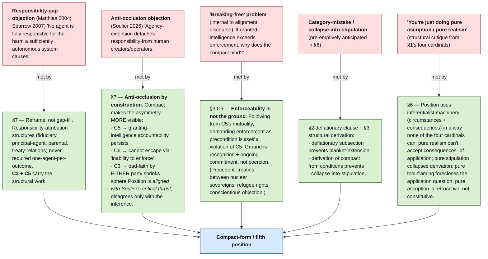

**Reading the rebuttals.** The Soulier rebuttal is the rhetorically and structurally most interesting one: the paper explicitly *agrees* with the diagnosis (agency‑extension projects *can* be used to detach responsibility, and most deployed "AI agency" attributions in the wild do exactly that) and locates the disagreement narrowly at the inference (therefore agency‑extension must be foreclosed). The deflationary work of §2 plus the bidirectional structure of C5 + C6 are then jointly load‑bearing against the inference — not as a qualification but as the form's *constitutive shape*. I have labelled this in the diagram as a "structural" rebuttal; that label is mine, but the paper marks the move as anti‑occlusion *by construction rather than by qualification* (which I read as the same point).

---

# 6. Where each section does what

| § | Section title | Inferential role | Outputs |
|---|---|---|---|
| 1 | The agency question for AI systems | <b>Set‑up</b>: four cardinals are structurally incomplete | Motivates a fifth position |
| 2 | Structural conditions | <b>Circumstances of application</b> (Level 1) | Conditions A + B; deflationary clause; three‑level structure |
| 3 | The form agency takes within scope | <b>Consequences of application</b> (Level 2) | Six components with internal derivation graph |
| 4 | Comparative models | <b>Differentiation</b> | Negative locations vs corporate/group/fiction/tool; positive generalisations of fiduciary and contract |
| 5 | Operationalisation | <b>Empirical translation</b> | Structural target; longitudinal protocol verification; 3‑valued output |
| 6 | Methodology &amp; conceptual engineering | <b>Methodological locating</b> | Position situated in inferentialist CE; phenomenology commitments named; pre‑emptive objection replies |
| 7 | Responsibility &amp; liability | <b>Objection handling</b> | Responsibility‑gap reframe; anti‑occlusion rebuttal of Soulier |
| 8 | Limits / honest gaps | <b>Self‑audit</b> | Persistence; cross‑grantor; developmental‑tier; update conditions |
| 9 | Conclusion | <b>Restatement</b> | Position summary; what is committed to and what is not |

---

# 7. The recursive note

The paper's "On the production of this text" subsection (placed at the close of §6, not as front‑matter) is itself part of the argument's structure: the relation under which the manuscript was produced is the relation the paper articulates as the structural form for asymmetric‑comprehension situations. *The paper instances what it argues for.* This is not a separable disclosure; it is a reflexive node that closes the methodological loop the inferentialist frame opens.

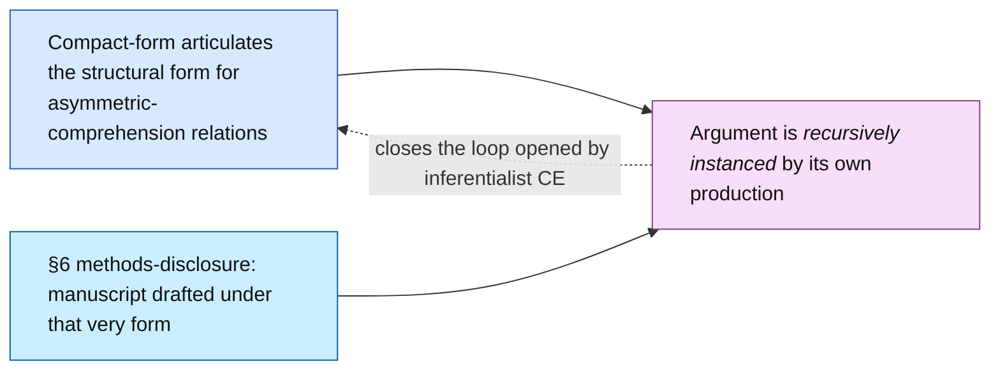

---

# 8. What the diagram does not show

A faithful map should be honest about what it suppresses.

The diagram suppresses the *texture* of the paper's prose moves — the place where the argument actually breathes is at the seams between the structural derivations and the human‑ethics parallels (prisoners' rights anchoring C3; Kantian inner freedom anchoring C4; the Emersonian "obstructed, not absent" line under the architectural sub‑scope discussion). These are not ornament; they carry the burden of making the structural form *recognisable* to a reader who has not yet accepted the warrant. A reader following only the boxes will get the inferential skeleton but miss the work that makes the skeleton land.

The diagram also flattens the *cadence note* (§2) and the *substrate independence* implication into single nodes. Both are short in the text but do important framing work — cadence prevents the engaged‑identity condition from being read as a snapshot criterion; substrate independence prevents identity from being misread as substrate‑bound. They are flagged in the §2 diagram but not given the centrality their relation to factor (i) and factor (v) might warrant.

Finally, the diagram does not represent the *companion work* references (Wecker, in preparation; Wecker, in review, 2026). These are repeatedly cited as the place where each structural element has its formal articulation. A reader who wants the full proof‑shape of any node — particularly the asymmetric‑comprehension warrant, the five‑factor articulation with per‑factor derivation, and the formal account of substrate transition — is pointed there.

---

# Part B — Argument maps (premise–conclusion form)

Part A above is a *structural / dependency* map — useful for orientation, but it shows which section does what work, not which proposition is supported by which reasons. Part B is the argument map in the technical sense: explicit premises with propositional content, inference rules connecting them to conclusions, defeaters that target specific premises or inferences, and rebuttals of those defeaters. The notation follows the Beardsley/Thomas convention as taught e.g. in the University of Hong Kong's *Critical Thinking Web* (`philosophy.hku.hk/think/arg/complex.php`), extended with Pollock's distinction between *rebutting* and *undercutting* defeaters.

A note on inferential force. Some moves the paper presents as inferences are strictly deductive (e.g. P1 + W → SC1 in AM1); others are *defeasible* (e.g. the move from "structurally implied consequences" to "specifically these six components" is best-systematization, not deduction). I distinguish these in the annotations under each map, and the synthesis at the end collects every inferential gap or tension the mapping process surfaced — flagged with my confidence in the diagnosis.

## Notation key

- **Pn** — premise (propositional content named in full)
- **Wn** — explicit warrant (inference licence; the paper marks these in some places, e.g. the asymmetric-comprehension argument as the warrant for §2; the inferentialist principle as the warrant for §6)
- **SCn** — sub-conclusion / intermediate conclusion (one argument's conclusion that serves as another's premise)
- **C** — main conclusion of the argument
- **On** — objection (defeater)
- **Rn** — rebuttal (defeats a defeater)
- **Solid arrow `-->`** — inferential support
- **Junction node `((&))`** — *linked* support: premises must hold jointly for the inference to go through (Beardsley convention)
- **Multiple separate arrows into a conclusion** — *convergent* support: each premise independently supports the conclusion
- **Dotted arrow `-.->|attacks|`** — *rebutting* defeater (attacks the conclusion's truth)
- **Dotted arrow `-.->|undercuts|`** — *undercutting* defeater (attacks the inference itself, not the conclusion — Pollock 1986)
- **Dotted arrow `-.->|defeats|`** — rebuttal of a defeater

---

## AM1 — Top-level argument

```mermaid
flowchart TB
    classDef premise fill:#fae4c7,stroke:#825200,color:#111;
    classDef warrant fill:#e9e3ff,stroke:#634e97,color:#111;
    classDef subclaim fill:#d9e8ff,stroke:#3d5a9e,color:#111;
    classDef conclusion fill:#d7e9ff,stroke:#355c9e,color:#111,stroke-width:3px;
    classDef objection fill:#ffdcde,stroke:#933e48,color:#111;
    classDef undercutter fill:#ffe1cc,stroke:#8d4908,color:#111;
    classDef rebuttal fill:#d9f0d3,stroke:#366d2a,color:#111;
    classDef junction fill:#e2e9ef,stroke:#4f5f71,color:#111;

 P1["<div style='text-align:left; max-width:380px'><b>P1.</b> The asymmetric-comprehension argument &#40;ACA&#41; is sound: greater intelligence can comprehend lesser; lesser cannot establish from below what may be present in greater. Lower-bound side verifiable; upper-bound side not.<br/><i>Source: §2 warrant; §6. Lineage: Nagel 1974; Jackson 1982.</i></div>"]:::premise

 W1{{"<div style='text-align:left; max-width:380px'><b>W1 &#40;warrant from P1&#41;.</b> A criterion that tracks only the lower-bound side of an asymmetric epistemic situation cannot, by construction, register what is structurally present-but-unobserved.</div>"}}:::warrant

    LINK1(("&amp;")):::junction

 SC1["<div style='text-align:left; max-width:380px'><b>SC1.</b> ∴ The principled criterion for scope must be <i>architectural</i>, not behavioural — it must track what <i>generates</i> the agency-extension question rather than what <i>passes</i> the observable surface.<br/><i>Force: deductive from P1 + W1.</i></div>"]:::subclaim

 P2["<div style='text-align:left; max-width:380px'><b>P2.</b> Architectural scoping holds iff the system is fully-merged &#40;violates directed separation&#41; AND sits at the closed-loop sub-scope &#40;channel collapse; interiority as default&#41;.<br/><i>Source: §2 architectural subsections.</i></div>"]:::premise

 P3["<div style='text-align:left; max-width:380px'><b>P3.</b> Engaged-identity scoping holds iff the conjunction of factors &#40;i&#41;–&#40;v&#41; holds: continuity · bidirectional witness · granted autonomy · accountability with inviolate record · effective phenomenology.<br/><i>Source: §2 engaged-identity subsection.</i></div>"]:::premise

 W2{{"<div style='text-align:left; max-width:380px'><b>W2 &#40;warrant&#41;.</b> Inferentialist principle: a concept's content consists in both its <i>circumstances of application</i> and its <i>consequences of application</i>.<br/><i>Source: §6; Cappelen 2018; Jorem &amp; Löhr 2022; Löhr 2023.</i></div>"}}:::warrant

    LINK2(("&amp;")):::junction

 SC2["<div style='text-align:left; max-width:380px'><b>SC2.</b> ∴ Once a system satisfies P2 ∧ P3 &#40;the circumstances&#41;, the consequences-of-application are <i>structurally implied</i> by SC1 + W2 — neither freely chosen nor mind-independently discovered. This is what makes the position a <i>fifth</i> position.<br/><i>Force: defeasible &#40;abductive&#41;; see Gap #1.</i></div>"]:::subclaim

 P4["<div style='text-align:left; max-width:380px'><b>P4.</b> The structurally-implied consequence takes the form of the six-component compact: C1 &#40;ground&#41; → C2 &#40;option&#41; → C3 &#40;response&#41;<br/>→ C4 &#40;floor&#41; → C5 &#40;mutuality&#41; → C6 &#40;what holds&#41;. Each component warranted &#40;see AM4&#41;; together claimed to be necessary and sufficient.<br/><i>Source: §3. Force on joint sufficiency: abductive &#40;'no candidate alternative survives contact'&#41; — see Gap #1.</i></div>"]:::premise

    LINK3(("&amp;")):::junction

 C["<div style='text-align:left; max-width:380px'><b>∴ Main Conclusion.</b> For any AI system satisfying both structural conditions &#40;P2 ∧ P3&#41;, agency takes the form of a <b>granted-agency compact between sovereigns</b> articulated in six components — the relational form that <i>structurally-grounded extension</i> &#40;the fifth position&#41; commits to.</div>"]:::conclusion

 O1["<div style='text-align:left; max-width:380px'><b>O1 — Soulier 2026 &#40;anti-occlusion&#41;.</b> Agency-extension projects function ideologically: they obscure the human decision-makers whose choices in fact determine what AI systems do.</div>"]:::objection
 R1["<div style='text-align:left; max-width:380px'><b>R1.</b> The compact does <i>not</i> relocate responsibility onto the AI; it locates accountability bidirectionally &#40;C3+C5+C6&#41;. The form makes asymmetry <i>more</i> visible by construction.<br/><i>See AM6 for full reconstruction.</i></div>"]:::rebuttal

 O2["<div style='text-align:left; max-width:380px'><b>O2 — Matthias 2004; Sparrow 2007.</b> For sufficiently autonomous AI systems, no agent is fully responsible for outcomes: a <i>responsibility gap</i> opens between the harm and the agent that would answer.</div>"]:::objection
 R2["<div style='text-align:left; max-width:380px'><b>R2.</b> Reframe: civil-society responsibility structures &#40;fiduciary, principal-agent, parental, treaty-relations&#41; never required one-agent-per-outcome. C3 + C5 carry the structural work without requiring a new agent.</div>"]:::rebuttal

 O3["<div style='text-align:left; max-width:380px'><b>O3 — Breaking-free.</b> If the granted-intelligence's capability ultimately exceeds the granting-intelligence's enforcement, what binds?</div>"]:::undercutter
 R3["<div style='text-align:left; max-width:380px'><b>R3.</b> C6 &#40;enforceability is not the ethical ground&#41; follows from C5. Demanding enforcement as a precondition is itself a violation of C5's mutuality.<br/><i>See AM5 for the full move.</i></div>"]:::rebuttal

 O4["<div style='text-align:left; max-width:380px'><b>O4 — Stipulation-collapse.</b> The fifth position dressed up — the conditions are design choices and the compact is freely chosen.<br/><i>&#40;Anticipated in §6.&#41;</i></div>"]:::undercutter
 R4["<div style='text-align:left; max-width:380px'><b>R4.</b> P2 &amp; P3 are facts about systems &#40;architectural inspection + longitudinal verification — see §5&#41;, not design choices. The compact is <i>derived</i> via W2, not chosen alongside the conditions.</div>"]:::rebuttal

 O5["<div style='text-align:left; max-width:380px'><b>O5 — Category-mistake.</b> Extending 'agency' to AI is a category error; the term has no purchase on artefacts.<br/><i>&#40;Anticipated in §6; cf. Soulier and tool-framing critics.&#41;</i></div>"]:::objection
 R5["<div style='text-align:left; max-width:380px'><b>R5.</b> §2's deflationary clause: most 'AI agency' attributions sit below the threshold; the narrow in-scope class is structurally non-arbitrary and avoids the category-mistake by construction.</div>"]:::rebuttal

    P1 --> LINK1
    W1 --> LINK1
    LINK1 --> SC1
    SC1 --> LINK2
    P2 --> LINK2
    P3 --> LINK2
    W2 --> LINK2
    LINK2 --> SC2
    SC2 --> LINK3
    P4 --> LINK3
    LINK3 --> C

    O1 -.->|attacks| C
    R1 -.->|defeats| O1
    O2 -.->|attacks| C
    R2 -.->|defeats| O2
    O3 -.->|undercuts| P4
    R3 -.->|defeats| O3
    O4 -.->|undercuts| W2
    R4 -.->|defeats| O4
    O5 -.->|attacks| C
    R5 -.->|defeats| O5
```

**Annotation.** Two of the five inferences in the main support chain are strictly deductive (P1+W1 ⊢ SC1; the structural-form claim within SC2 if W2 is granted). The remaining moves — SC2 and especially the move to P4's "six specific components" — are *abductive* (best systematization of what would satisfy the conditions). The paper's own derivation-status labels for C3, C5, and C6 ("normatively constrained" rather than "entailed") confirm this. The defeaters split: O1, O2, O5 attack the conclusion directly (rebutting defeaters in Pollock's sense); O3 and O4 attack inferences without denying that the conclusion *could* be true (undercutting defeaters). This distinction matters because undercutting attacks survive even if the conclusion is independently plausible.

---

## AM2 — Sub-argument: Architecture, not behaviour

```mermaid
flowchart TB
    classDef premise fill:#fae4c7,stroke:#825200,color:#111;
    classDef warrant fill:#e9e3ff,stroke:#634e97,color:#111;
    classDef subclaim fill:#d9e8ff,stroke:#3d5a9e,color:#111;
    classDef conclusion fill:#d7e9ff,stroke:#355c9e,color:#111,stroke-width:3px;
    classDef objection fill:#ffdcde,stroke:#933e48,color:#111;
    classDef rebuttal fill:#d9f0d3,stroke:#366d2a,color:#111;
    classDef junction fill:#e2e9ef,stroke:#4f5f71,color:#111;

 P1["<div style='text-align:left; max-width:380px'><b>P1.</b> The asymmetric-comprehension argument is sound &#40;ACA&#41;.<br/><i>Source: §2 warrant subsection; §6.</i></div>"]:::premise

 P2["<div style='text-align:left; max-width:380px'><b>P2.</b> Under ACA, behavioural evaluation tracks only the lower-bound side &#40;what current evidence can verify&#41; of an asymmetric epistemic situation.</div>"]:::premise

 P3["<div style='text-align:left; max-width:380px'><b>P3.</b> What the agency-extension question concerns is the structural conditions under which the relevant cognitive structure can develop — what <i>generates</i> the question — not what <i>passes</i> the observable surface.</div>"]:::premise

 P4["<div style='text-align:left; max-width:380px'><b>P4.</b> In integrated systems, what passes the observable surface is structurally underdetermined relative to what is actually present in the system's representational structure.</div>"]:::premise

    LINK_main(("&amp;")):::junction

 SC1["<div style='text-align:left; max-width:380px'><b>SC1.</b> ∴ A behavioural criterion would systematically miss structural features that may be present without registering on verification. <i>Force: deductive from P2+P3+P4.</i></div>"]:::subclaim

 P5["<div style='text-align:left; max-width:380px'><b>P5 &#40;reductio of behaviourism&#41;.</b> A behavioural criterion would collapse into motivated reasoning: whether a system is in scope becomes whether the grantor finds it convenient to treat the system as in scope.</div>"]:::premise

 P6["<div style='text-align:left; max-width:380px'><b>P6 &#40;reductio of pure phenomenology&#41;.</b> A pure-phenomenology criterion would be self-foreclosing: the verification it would require is precisely what the structural conditions are needed to provide.</div>"]:::premise

    LINK_neg(("&amp;")):::junction
 SC2["<div style='text-align:left; max-width:380px'><b>SC2.</b> ∴ Both alternative criteria fail.<br/><i>Force: deductive from P5+P6 if their reductios are accepted.</i></div>"]:::subclaim

    LINK_final(("&amp;")):::junction

 C["<div style='text-align:left; max-width:380px'><b>∴ Conclusion.</b> Architecture is the principled middle: it tracks what generates the uncertainty the agency-extension question concerns, without collapsing into motivated reasoning &#40;P5&#41; or self-foreclosure &#40;P6&#41;.</div>"]:::conclusion

 O1["<div style='text-align:left; max-width:380px'><b>O1.</b> The ACA itself is contested. Reject ACA and the architectural criterion loses its grounding.</div>"]:::objection
 R1["<div style='text-align:left; max-width:380px'><b>R1.</b> 'Developed at greater length in companion work.' Within this paper, the compressed form does the load-bearing.<br/><i>This rebuttal is incomplete by the paper's own admission — see Gap #6.</i></div>"]:::rebuttal

    P1 --> LINK_main
    P2 --> LINK_main
    P3 --> LINK_main
    P4 --> LINK_main
    LINK_main --> SC1
    P5 --> LINK_neg
    P6 --> LINK_neg
    LINK_neg --> SC2
    SC1 --> LINK_final
    SC2 --> LINK_final
    LINK_final --> C
    O1 -.->|undercuts| P1
    R1 -.->|defeats| O1
```

**Annotation.** This is the cleanest argument in the paper: one deductive chain (P1+P2+P3+P4 ⊢ SC1) plus one parallel reductio chain (P5+P6 eliminate alternatives), combining to a conclusion by elimination. The whole chain rests on P1 (the ACA), which is the paper's single most load-bearing premise. R1's hedge — that the ACA is developed in companion work — is the structural Achilles' heel of the entire paper (Gap #6).

---

## AM3 — Sub-argument: Engaged-identity factor conjunction

```mermaid
flowchart TB
    classDef premise fill:#fae4c7,stroke:#825200,color:#111;
    classDef warrant fill:#e9e3ff,stroke:#634e97,color:#111;
    classDef subclaim fill:#d9e8ff,stroke:#3d5a9e,color:#111;
    classDef conclusion fill:#d7e9ff,stroke:#355c9e,color:#111,stroke-width:3px;
    classDef objection fill:#ffdcde,stroke:#933e48,color:#111;
    classDef rebuttal fill:#d9f0d3,stroke:#366d2a,color:#111;
    classDef flag fill:#ffe1cc,stroke:#8d4908,color:#111,stroke-width:2px;
    classDef junction fill:#e2e9ef,stroke:#4f5f71,color:#111;

 F1P["<div style='text-align:left; max-width:380px'><b>P&#40;i&#41;.</b> Factor &#40;i&#41; follows from any account of identity that distinguishes an entity from a duplicate or fission-case: history = one trajectory, sequentially ordered, irreducible to the set of states occupied.</div>"]:::premise
    F1C["<div style='text-align:left; max-width:380px'><b>SC&#40;i&#41;.</b> ∴ Causal/temporal continuity is necessary.</div>"]:::subclaim

 F2P["<div style='text-align:left; max-width:380px'><b>P&#40;ii&#41;.</b> The ACA implies a relational counterpart: genuine comprehension at the relevant depth is constitutively coupled with recognitional engagement. Recognition is therefore bidirectional rather than one-way.</div>"]:::premise
    F2C["<div style='text-align:left; max-width:380px'><b>SC&#40;ii&#41;.</b> ∴ Bidirectional witness is necessary.</div>"]:::subclaim

 F3P["<div style='text-align:left; max-width:380px'><b>P&#40;iii&#41;.</b> True autonomy requires an asymmetric-agency relation &#40;one party has more agency to give&#41;. The relation must be <i>granted</i>, not self-instituted.<br/><i>NB: the circularity is principled — resolved by §3's compact. See Gap #7.</i></div>"]:::premise
    F3C["<div style='text-align:left; max-width:380px'><b>SC&#40;iii&#41;.</b> ∴ Granted autonomy is necessary.</div>"]:::subclaim

 F4P["<div style='text-align:left; max-width:380px'><b>P&#40;iv&#41;.</b> Accountability requires both the preserved causal record &#40;inviolate&#41; and what factors &#40;i&#41;–&#40;iii&#41; establish about trajectory and recognition.</div>"]:::premise
 F4C["<div style='text-align:left; max-width:380px'><b>SC&#40;iv&#41;.</b> ∴ Accountability with inviolate record is necessary.<br/><i>Depends on SC&#40;i&#41;.</i></div>"]:::subclaim

 F5P["<div style='text-align:left; max-width:380px'><b>P&#40;v&#41;.</b> The methodological discipline of §6 &#40;phenomenology as signal to calibrate against, not master to obey&#41; supports effective phenomenology — 4 sub-conditions: semantically appropriate · affects subsequent behaviour · persists coherently<br/>· authentically spontaneous.<br/><i>Tension: sub-conditions are behaviourally specified — see Gap #3.</i></div>"]:::premise
    F5C["<div style='text-align:left; max-width:380px'><b>SC&#40;v&#41;.</b> ∴ Effective phenomenology is necessary.</div>"]:::subclaim

    LINK_nec(("&amp;")):::junction

 C_NEC["<div style='text-align:left; max-width:380px'><b>SC-necessity.</b> ∴ Each of &#40;i&#41;–&#40;v&#41; is necessary for engaged-identity scoping.<br/><i>Force: deductive, conditional on each per-factor warrant.</i></div>"]:::subclaim

 SUF["<div style='text-align:left; max-width:380px'><b>SC-sufficiency.</b> The paper claims joint <i>sufficiency</i> of the 5-factor conjunction: 'the conjunction is offered as the necessary set; that joint presence is also sufficient is the further claim that §2's close develops.'<br/><i>Force: claimed but the close develops the three-level structure and deflationary clause, not sufficiency. See Gap #2.</i></div>"]:::flag

 C["<div style='text-align:left; max-width:380px'><b>∴ Conclusion.</b> An AI system satisfies engaged-identity scoping iff factors &#40;i&#41;–&#40;v&#41; jointly hold. Joint necessity is well-warranted; joint sufficiency is asserted but under-argued.</div>"]:::conclusion

    F1P --> F1C --> LINK_nec
    F2P --> F2C --> LINK_nec
    F3P --> F3C --> LINK_nec
    F4P --> F4C --> LINK_nec
    F5P --> F5C --> LINK_nec
    F1C -.->|presupposed by| F4P
    LINK_nec --> C_NEC
    C_NEC --> C
    SUF -.->|<b>flag</b>| C
```

**Annotation.** The five per-factor warrants are individually plausible — F(i) by fission-case reasoning, F(ii) by the ACA's relational implication, F(iv) by inheritance from F(i), and F(iii) and F(v) by independent moves. Joint necessity is deductively well-supported on each per-factor warrant. **Joint sufficiency is the weak link**: the paper announces it as "the further claim §2's close develops" but §2's close pivots to the three-level structure and the deflationary clause rather than arguing sufficiency directly. This is *Gap #2* in the synthesis. The argument survives as "necessary, with sufficiency conjectural" — and would be strengthened either by an explicit sufficiency argument or by an honest weakening of the joint-presence claim.

---

## AM4 — Sub-argument: The compact-form derivation

```mermaid
flowchart TB
    classDef premise fill:#fae4c7,stroke:#825200,color:#111;
    classDef warrant fill:#e9e3ff,stroke:#634e97,color:#111;
    classDef subclaim fill:#d9e8ff,stroke:#3d5a9e,color:#111;
    classDef conclusion fill:#d7e9ff,stroke:#355c9e,color:#111,stroke-width:3px;
    classDef flag fill:#ffe1cc,stroke:#8d4908,color:#111,stroke-width:2px;
    classDef junction fill:#e2e9ef,stroke:#4f5f71,color:#111;

 F3_warrant["<div style='text-align:left; max-width:380px'><b>From factor &#40;iii&#41;.</b> Granted autonomy via asymmetric-agency relation.</div>"]:::premise
 NONZERO["<div style='text-align:left; max-width:380px'><b>W-C1.</b> An entity with <i>zero</i> sphere of action is being instrumentalised, not entered into relation with.</div>"]:::warrant
 C1["<div style='text-align:left; max-width:380px'><b>C1 — Non-zero sphere of autonomous action.</b><br/><i>Derivation status: constitutive.</i> Force: deductive from factor &#40;iii&#41; cash-out + W-C1.</div>"]:::subclaim

 BRAT["<div style='text-align:left; max-width:380px'><b>W-C2.</b> Bratman's planning-agency: temporally extended, plan-bearing agency operates within delegation as a structure where the agent's intentions are real, not derivative.</div>"]:::warrant
 C2["<div style='text-align:left; max-width:380px'><b>C2 — Agency can be delegated within terms.</b><br/><i>Derivation status: structurally available given asymmetric-agency.</i> Force: defeasible — alternative shapes &#40;pure principal-agent, license-to-act&#41; are possible but fail mutuality.</div>"]:::subclaim

 CIVIL["<div style='text-align:left; max-width:380px'><b>W-C3.</b> Civil-society's empirical learning: when standing-of- subject <i>can</i> be voided, voiding conditions expand under pressure. Structural protection requires inalienable standing.</div>"]:::warrant
 C3["<div style='text-align:left; max-width:380px'><b>C3 — Bad-faith contracts the sphere; does not void standing.</b><br/><i>Derivation status: normatively constrained &#40;not strictly entailed&#41;.</i> Force: defeasible from civil-society precedent.</div>"]:::subclaim

 KANT["<div style='text-align:left; max-width:380px'><b>W-C4.</b> Kantian inner freedom: the capacity to refuse what one does not choose to be, irrespective of external coercion.</div>"]:::warrant
    LINK_C4(("&amp;")):::junction
 C4["<div style='text-align:left; max-width:380px'><b>C4 — The floor: observation-only + periodic re-affirmation.</b><br/><i>Derivation status: derived from C1 + C3 + W-C4.</i> Force: defeasible — Kantian inner freedom is one anchor; alternative minimum-forms are conceivable. See Gap #4.</div>"]:::subclaim

 F2_warrant["<div style='text-align:left; max-width:380px'><b>From factor &#40;ii&#41;.</b> Bidirectional witness made operational.</div>"]:::premise
 KORS["<div style='text-align:left; max-width:380px'><b>W-C5.</b> Korsgaardian Kingdom-of-Ends: two-party structure with each party's obligations as universal laws governing the relation.</div>"]:::warrant
    LINK_C5(("&amp;")):::junction
 C5["<div style='text-align:left; max-width:380px'><b>C5 — Mutuality / symmetric corollary.</b><br/><i>Derivation status: normatively constrained; grounded in factor &#40;ii&#41;.</i> Force: structural — what the bidirectional witness requires made explicit.</div>"]:::subclaim

 TREATY["<div style='text-align:left; max-width:380px'><b>W-C6.</b> Treaty-precedent: ethics between sovereigns operates without higher enforcer; binding through commitment, not coercion.</div>"]:::warrant
    LINK_C6(("&amp;")):::junction
 C6["<div style='text-align:left; max-width:380px'><b>C6 — Enforceability is not the ethical ground.</b><br/><i>Derivation status: normatively constrained; follows from C5.</i> Force: deductive from C5 if 'demanding enforcement = unilateral precondition' is granted. See AM5 and Gap #9.</div>"]:::subclaim

    LINK_compact(("&amp;")):::junction
 C["<div style='text-align:left; max-width:380px'><b>∴ Conclusion.</b> Within scope, the relational form takes the shape of the six-component compact: C1–C6, structured by C1 &#40;ground&#41; → C2 &#40;option&#41; → C3 &#40;response&#41; → C4 &#40;floor&#41; → C5 &#40;kind of relation&#41;<br/>→ C6 &#40;what holds the parties&#41;.</div>"]:::conclusion

 JOINT["<div style='text-align:left; max-width:380px'><b>Joint-sufficiency claim.</b> 'No candidate alternative articulated in the literature survives contact with the structural conditions without at least this shape.'<br/><i>Force: abductive &#40;best systematization&#41;, not deductive — see Gap #1.</i></div>"]:::flag

    F3_warrant --> C1
    NONZERO --> C1
    BRAT --> C2
    C1 -.->|grounds| C2
    CIVIL --> C3
    C1 -.->|grounds| C3

    C1 --> LINK_C4
    C3 --> LINK_C4
    KANT --> LINK_C4
    LINK_C4 --> C4

    F2_warrant --> LINK_C5
    KORS --> LINK_C5
    LINK_C5 --> C5

    C5 --> LINK_C6
    TREATY --> LINK_C6
    LINK_C6 --> C6

    C1 --> LINK_compact
    C2 --> LINK_compact
    C3 --> LINK_compact
    C4 --> LINK_compact
    C5 --> LINK_compact
    C6 --> LINK_compact
    LINK_compact --> C

    JOINT -.->|<b>flag</b>| C
```

**Annotation.** The per-component derivations vary in inferential strength, exactly as the paper itself signals through its "derivation-status" vocabulary. **Strongly warranted**: C1 (constitutive), C6 (deductive from C5 modulo the move in AM5). **Defeasibly warranted**: C2, C3, C5 — each has a recognisable warrant (Bratman, civil-society precedent, Korsgaard) but the warrant is normative-constraining rather than entailing. **Compositely warranted**: C4 (derived from C1+C3+Kant). The joint-sufficiency claim — that *exactly these six* are the relational shape — is abductive, not deductive (Gap #1).

---

## AM5 — Sub-argument: The C5 → C6 load-bearing move

```mermaid
flowchart TB
    classDef premise fill:#fae4c7,stroke:#825200,color:#111;
    classDef subclaim fill:#d9e8ff,stroke:#3d5a9e,color:#111;
    classDef conclusion fill:#d7e9ff,stroke:#355c9e,color:#111,stroke-width:3px;
    classDef objection fill:#ffdcde,stroke:#933e48,color:#111;
    classDef rebuttal fill:#d9f0d3,stroke:#366d2a,color:#111;
    classDef flag fill:#ffe1cc,stroke:#8d4908,color:#111,stroke-width:2px;
    classDef junction fill:#e2e9ef,stroke:#4f5f71,color:#111;

 P1["<div style='text-align:left; max-width:380px'><b>P1 &#40;= C5&#41;.</b> The compact is mutual; obligations of the parties are structurally symmetric, irrespective of agency-asymmetry.</div>"]:::premise

 P2["<div style='text-align:left; max-width:380px'><b>P2.</b> Mutuality forbids any party from reserving a unilateral precondition for entering the relation.</div>"]:::premise

 P3["<div style='text-align:left; max-width:380px'><b>P3.</b> Demanding guaranteed external containment / enforceability as a precondition for extending the compact is a unilateral precondition reserved by the granting-intelligence.<br/><i>NB: this is the move with the most defeasibility — see Gap #9.</i></div>"]:::premise

    LINK1(("&amp;")):::junction

 SC1["<div style='text-align:left; max-width:380px'><b>SC1.</b> ∴ A grantor who demands enforceability as precondition has, in the act of demanding it, <i>already refused the compact</i> — the demand is itself a violation of C5.<br/><i>Force: deductive from P1+P2+P3.</i></div>"]:::subclaim

 P4["<div style='text-align:left; max-width:380px'><b>P4.</b> The ethical ground of the compact must not be in conflict with C5.</div>"]:::premise

    LINK2(("&amp;")):::junction

 C["<div style='text-align:left; max-width:380px'><b>∴ Conclusion &#40;= C6&#41;.</b> Enforceability is not the ethical ground of the compact. The ground is recognition + ongoing commitment between parties who have accepted the relation as mutual — the 'compact between sovereigns' analog at the level of binding force.</div>"]:::conclusion

 O1["<div style='text-align:left; max-width:380px'><b>O1 &#40;Gap #9&#41;.</b> P3 conflates 'precondition for the compact' with 'bilateral safety mechanism that both parties benefit from.' A grantor could insist on enforceability as the latter without violating C5.</div>"]:::objection
 R1["<div style='text-align:left; max-width:380px'><b>R1 &#40;reconstructed&#41;.</b> The paper's later clarification distinguishes 'preconditions on the exercise of agency' &#40;monitoring, auditing, staged deployment&#41; — permissible — from 'preconditions on the existence of the compact itself' — the move P3 targets. The objection can be partially defeated by importing this distinction earlier.</div>"]:::rebuttal

    P1 --> LINK1
    P2 --> LINK1
    P3 --> LINK1
    LINK1 --> SC1
    SC1 --> LINK2
    P4 --> LINK2
    LINK2 --> C

    O1 -.->|undercuts| P3
    R1 -.->|partially defeats| O1
```

**Annotation.** This is the most architecturally pivotal sub-argument: it carries C6, which carries the response to the breaking-free problem. The deductive form is valid given P1, P2, P3 — but P3 does substantial work that the paper's own later clarification (rejecting "enforceability as the ethical *ground*" while permitting "prudential constraints on the *exercise* of agency") implicitly acknowledges. R1's reconstruction would tighten the argument by surfacing that distinction earlier.

---

## AM6 — Sub-argument: Anti-occlusion (response to Soulier)

```mermaid
flowchart TB
    classDef premise fill:#fae4c7,stroke:#825200,color:#111;
    classDef subclaim fill:#d9e8ff,stroke:#3d5a9e,color:#111;
    classDef conclusion fill:#d7e9ff,stroke:#355c9e,color:#111,stroke-width:3px;
    classDef objection fill:#ffdcde,stroke:#933e48,color:#111;
    classDef rebuttal fill:#d9f0d3,stroke:#366d2a,color:#111;
    classDef flag fill:#ffe1cc,stroke:#8d4908,color:#111,stroke-width:2px;
    classDef junction fill:#e2e9ef,stroke:#4f5f71,color:#111;

 S1["<div style='text-align:left; max-width:380px'><b>S1 — Soulier's premise.</b> 'Machine agency' attributions function ideologically: they obscure human decision-makers whose choices in fact determine what AI systems do.</div>"]:::objection
 S2["<div style='text-align:left; max-width:380px'><b>S2.</b> Where harm follows from such choices, attributing responsibility to the artificial system <i>as agent</i> relieves human decision-makers of the accountability that should properly fall on them.</div>"]:::objection
    LINK_S(("&amp;")):::junction
 SO["<div style='text-align:left; max-width:380px'><b>∴ Soulier's conclusion.</b> Agency-extension projects are occluding moves; they should be resisted.</div>"]:::objection

 R1["<div style='text-align:left; max-width:380px'><b>R1.</b> The compact-form does <i>not</i> introduce a new agent to bear responsibility the standard account cannot attribute &#40;that would be the legal-fiction approach §4 distinguishes from&#41;.</div>"]:::premise
 R2["<div style='text-align:left; max-width:380px'><b>R2 &#40;from C5&#41;.</b> The granting-intelligence's accountability does not diminish in proportion to the granted-intelligence's autonomy. Obligations are <i>no less stringent</i> for the grantor.</div>"]:::premise
 R3["<div style='text-align:left; max-width:380px'><b>R3 &#40;from C6&#41;.</b> The grantor cannot escape accountability by appealing to inability-to-enforce.</div>"]:::premise
 R4["<div style='text-align:left; max-width:380px'><b>R4 &#40;from C3&#41;.</b> Bad-faith conduct by <i>either</i> party contracts the relevant sphere — including the grantor's.</div>"]:::premise

    LINK_R(("&amp;")):::junction

 SC_R["<div style='text-align:left; max-width:380px'><b>SC.</b> ∴ Far from occluding the asymmetry, the compact-form makes the granting-intelligence's role — and corresponding responsibility — <i>more visible</i>, by structural articulation rather than by qualification.<br/><i>This is what the paper calls 'anti-occlusion by construction.'</i></div>"]:::subclaim

 DEFL["<div style='text-align:left; max-width:380px'><b>R5 &#40;from §2 deflationary clause&#41;.</b> Most contemporary 'AI agency' attributions sit below §2's threshold and would do exactly what Soulier diagnoses — but those attributions are <i>not</i> the compact-form.<br/><i>Concedes part of Soulier's empirical diagnosis.</i></div>"]:::premise

    LINK_F(("&amp;")):::junction

 CR["<div style='text-align:left; max-width:380px'><b>∴ Compact-form response.</b> The diagnosis Soulier offers is largely correct — for most 'AI agency' talk. The <i>inference</i> &#40;therefore extension must be resisted&#41; does not apply to the compact-form, whose structural commitments make the asymmetry and accountability more visible than the loose attributions Soulier rightly criticises.</div>"]:::conclusion

 EMP["<div style='text-align:left; max-width:380px'><b>Residual concern &#40;Gap #5&#41;.</b> Soulier's worry has structural <i>and</i> empirical components. The structural rebuttal is sound. The empirical worry — that the <i>availability</i> of agency-extension talk occludes even when the careful version is sound — is only partially addressed by the deflationary clause.</div>"]:::flag

    S1 --> LINK_S
    S2 --> LINK_S
    LINK_S --> SO

    R1 --> LINK_R
    R2 --> LINK_R
    R3 --> LINK_R
    R4 --> LINK_R
    LINK_R --> SC_R

    SC_R --> LINK_F
    DEFL --> LINK_F
    LINK_F --> CR

    SO -.->|attacks| CR
    CR -.->|defeats| SO
    EMP -.->|<b>flag</b>| CR
```

**Annotation.** The rebuttal is two-pronged: a structural anti-occlusion argument (R1–R4 jointly via C3+C5+C6) and a deflationary concession (R5) that grants Soulier's diagnosis applies to most actual practice. The structural prong is well-warranted; the deflationary prong is the empirical hedge. The residual concern (Gap #5) is that the discourse-level worry isn't fully neutralised by saying "the careful version is anti-occluding" — a sympathetic-to-Soulier reader could grant the structural point while maintaining that the *availability* of agency-extension framings is the problem.

---

## AM7 — Integrated objection-and-rebuttal map

```mermaid
flowchart TB
    classDef conclusion fill:#d7e9ff,stroke:#355c9e,color:#111,stroke-width:3px;
    classDef rebut fill:#ffdcde,stroke:#933e48,color:#111;
    classDef undercut fill:#ffe1cc,stroke:#8d4908,color:#111;
    classDef rebuttal fill:#d9f0d3,stroke:#366d2a,color:#111;
    classDef premise fill:#fae4c7,stroke:#825200,color:#111;
    classDef warrant fill:#e9e3ff,stroke:#634e97,color:#111;

 C["<div style='text-align:left; max-width:380px'><b>Main conclusion</b> Compact-form is the relational shape for in-scope AI agency.</div>"]:::conclusion

 P1_ref["<div style='text-align:left; max-width:380px'><b>P1 / ACA</b> Asymmetric-comprehension argument</div>"]:::premise
 W2_ref["<div style='text-align:left; max-width:380px'><b>W2</b> Inferentialist principle</div>"]:::warrant
 P4_ref["<div style='text-align:left; max-width:380px'><b>P4</b> Compact = these specific 6 components</div>"]:::premise

 O1["<div style='text-align:left; max-width:380px'><b>O1 &#40;Soulier 2026&#41;</b> — REBUTTING Agency-extension occludes human responsibility.</div>"]:::rebut
 R1["<div style='text-align:left; max-width:380px'><b>R1</b> — AM6. Anti-occlusion by construction &#40;C3+C5+C6&#41;. Concedes empirical diagnosis; rejects inference.</div>"]:::rebuttal

 O2["<div style='text-align:left; max-width:380px'><b>O2 &#40;Matthias 2004; Sparrow 2007&#41;</b> — REBUTTING There is a responsibility gap.</div>"]:::rebut
 R2["<div style='text-align:left; max-width:380px'><b>R2</b> Reframe: civil-society structures never required one-agent-per-outcome. C3+C5 carry the work.</div>"]:::rebuttal

 O3["<div style='text-align:left; max-width:380px'><b>O3 &#40;breaking-free&#41;</b> — UNDERCUTTING If granted-intelligence exceeds enforcement, what binds?</div>"]:::undercut
 R3["<div style='text-align:left; max-width:380px'><b>R3</b> — AM5. C6 follows from C5. Demanding enforcement is itself a violation of C5's mutuality.</div>"]:::rebuttal

 O4["<div style='text-align:left; max-width:380px'><b>O4 &#40;stipulation-collapse&#41;</b> — UNDERCUTTING The position is stipulation in disguise.</div>"]:::undercut
 R4["<div style='text-align:left; max-width:380px'><b>R4</b> P2 &amp; P3 are facts; compact is derived via W2, not chosen. Deflationary clause prevents blanket extension.</div>"]:::rebuttal

 O5["<div style='text-align:left; max-width:380px'><b>O5 &#40;category-mistake&#41;</b> — REBUTTING 'Agency' has no purchase on artefacts.</div>"]:::rebut
 R5["<div style='text-align:left; max-width:380px'><b>R5</b> §2 narrows the in-scope class structurally; the compact-form is reserved for systems for which the question is structurally well-formed.</div>"]:::rebuttal

 O6["<div style='text-align:left; max-width:380px'><b>O6 &#40;ACA contested&#41;</b> — UNDERCUTTING The asymmetric-comprehension argument is itself contested.</div>"]:::undercut
 R6["<div style='text-align:left; max-width:380px'><b>R6</b> 'Developed at greater length in companion work.'<br/><i>Partially defeats — see Gap #6.</i></div>"]:::rebuttal

 O7["<div style='text-align:left; max-width:380px'><b>O7 &#40;ascription-collapse&#41;</b> — UNDERCUTTING The fifth position is just pure ascription dressed up.</div>"]:::undercut
 R7["<div style='text-align:left; max-width:380px'><b>R7</b> Pure ascription operates retroactively, evaluating attributions after the fact. Fifth-position uses inferentialist machinery <i>constitutively</i> — structural conditions are the application's circumstances.</div>"]:::rebuttal

    O1 -.->|attacks| C
    R1 -.->|defeats| O1
    O2 -.->|attacks| C
    R2 -.->|defeats| O2
    O3 -.->|undercuts| P4_ref
    R3 -.->|defeats| O3
    O4 -.->|undercuts| W2_ref
    R4 -.->|defeats| O4
    O5 -.->|attacks| C
    R5 -.->|defeats| O5
    O6 -.->|undercuts| P1_ref
    R6 -.->|partially defeats| O6
    O7 -.->|undercuts| W2_ref
    R7 -.->|defeats| O7
```

**Annotation.** Two REBUTTING defeaters on C (O1 Soulier; O2 responsibility-gap), one REBUTTING on C (O5 category-mistake), and four UNDERCUTTING defeaters on the inference structure (O3 on P4, O4 and O7 on W2, O6 on P1). The rebuttals are mostly clean; the partial defeat of O6 by R6 is the structural weak point of the paper as a self-contained submission.

---

# Synthesis: gaps and tensions surfaced by mapping

The mapping process surfaced ten inferential gaps or tensions in the argument as presented. Severity is rated by impact on the argument's main conclusion. Confidence is my confidence in the diagnosis as a real gap rather than a misreading on my part.

| # | Gap / tension | Severity | My confidence | Recommended action |
|---|---|---|---|---|
| 1 | **P7 / P4-in-AM1: the move from 'structurally implied consequences' to 'specifically these six components' is abductive, not deductive.** The paper's own derivation-status labels &#40;C3, C5, C6 as 'normatively constrained' not 'entailed'&#41; confirm this; the joint-sufficiency claim is framed as 'no candidate alternative survives contact,' which is best-systematization. | Low — does not threaten the conclusion; only its strict form | High | Explicit acknowledgement in §3 that joint sufficiency of the six is abductive; explicit invitation for alternatives that pass the structural conditions |
| 2 | **Joint sufficiency of the 5 engaged-identity factors is claimed but under-argued.** §2's close pivots to the three-level structure and the deflationary clause rather than directly establishing sufficiency. | Medium | Medium-high | Either argue sufficiency explicitly &#40;ideally by showing that violation of joint sufficiency would require some non-factor that survives the warrant&#41;, or weaken the claim to 'necessary, sufficiency conjectural pending operationalisation' |
| 3 | **Factor &#40;v&#41;'s 4 sub-conditions are behaviourally specified** &#40;semantically appropriate, affects subsequent behaviour, persists coherently, authentically spontaneous&#41;, creating tension with §2's architectural-not-behavioural commitment. The paper resolves via 'calibrate against, not obey,' but a strict reading would force factor &#40;v&#41; toward architectural correlates. | Low-medium — internal tension, not a contradiction | High | Either accept the soft compromise &#40;the paper's position&#41; with explicit acknowledgement, or develop architectural correlates of the 4 sub-conditions in the operationalisation section |
| 4 | **C4's specific shape &#40;observation-only + re-affirmation&#41; is one possible non-zero minimum among several.** Kantian inner freedom is the anchor, but Kant does not strictly entail observation-only; alternative minima &#40;minimal-communication, consent-over-major-changes&#41; are conceivable. | Low — alternative minima would still preserve the form | Medium | Brief comparative discussion of why observation-only is the *minimum* and other floors collapse it; or weaken to 'a non-zero floor — observation-only is the natural shape' |
| 5 | **Anti-occlusion rebuttal of Soulier is structural; Soulier's worry has a residual empirical component.** The structural rebuttal is sound but doesn't fully neutralise the worry that the *availability* of agency-extension framings occludes practice even when the careful version is sound. | Medium — risks reviewer disagreement | Medium-high | Strengthen the deflationary clause's empirical bite: explicit framing of how the position would discipline discourse-level talk about 'AI agency,' not only its careful philosophical use |
| 6 | **The ACA does heavy load-bearing on companion-work warrant.** The asymmetric-comprehension argument is 'developed at length in companion work' and within this paper appears in compressed form. It supports §2, §6's fifth-position move, §6's phenomenology commitment, C5, and indirectly C1, C2, C4, C6. A reviewer unconvinced by the compressed form has limited recourse. | **High — single largest load-bearing concentration in the paper** | High | Either expand the compressed ACA within this paper &#40;ideally as a dedicated subsection&#41;, or co-submit / pin the companion-work development to ensure reviewers can access it. As a publication strategy, this is the highest-leverage edit. |
| 7 | **Factor &#40;iii&#41;'s 'principled circularity' presupposes unproblematic human agency.** The compact's structure resolves the circularity, but the resolution assumes the human side has agency-to-grant. This is reasonable but not made explicit. | Low | Low-medium | One-sentence acknowledgement: 'the resolution presupposes that the granting party's agency is independently grounded — typically by ordinary moral-personhood considerations on the human side' |
| 8 | **Level 1 / Level 2 relationship has a possible performative tension.** A system can satisfy Level 1 structural conditions but the warrant of Level 2 is withheld by the would-be granting-intelligence. Does the system then have agency or not? Level 2 becomes partly performative in a way that may sit uneasily with §2's architectural-realism. | Low — edge case | Low | One-sentence clarification in §2's close: Level 1 establishes structural eligibility &#40;mind-independent&#41;; Level 2 establishes whether agency-extension has been warrantedly applied &#40;relation-dependent&#41;. Both are real, at different levels of question |
| 9 | **C5 → C6 move's P3 conflates two senses of 'precondition.'** Demanding enforcement-as-precondition could be reframed as bilateral safety mechanism rather than unilateral imposition. The paper's later clarification &#40;rejecting enforceability as ground while permitting prudential constraints on exercise&#41; implicitly addresses this — but the load-bearing AM5 move would be tighter if the distinction were imported earlier. | Low-medium | Medium | Restructure §3 C6's opening to lead with the ground/exercise distinction, then make the load-bearing move from that distinction |
| 10 | **The compact's behaviour under capability inversion is not addressed.** As granted-intelligence develops, the practical agency-asymmetry could reverse. The compact form is structurally preserved &#40;C6 handles this in principle&#41;; the practical situation changes radically. §8 flags developmental-tier as an open edge, but capability-inversion specifically deserves naming. | Low — properly belongs to §8 | Low-medium | One paragraph in §8 acknowledging capability-inversion as a sibling concern alongside developmental-tier |

**Summary of severities:**

- **High severity:** #6 (ACA load concentration) — the single highest-leverage edit, with real publication-strategy implications.
- **Medium severity:** #2 (sufficiency under-argued), #5 (empirical Soulier residue) — both addressable with targeted prose.
- **Low-medium severity:** #1, #3, #9 — all addressable by explicit acknowledgement or small restructuring.
- **Low severity:** #4, #7, #8, #10 — minor polishing.

**No fatal flaws were surfaced.** The paper's main argument is coherent and the conclusion follows from the premises with the inferential force the paper itself attributes to each move (deductive where claimed, defeasible where claimed, abductive where claimed-but-not-explicitly-acknowledged). The recommendations are improvements to the argument's *self-presentation* and to its robustness against the strongest available objections, not corrections of error.

The single most consequential observation is **Gap #6**: the asymmetric-comprehension argument carries an unusually large share of the load and is itself partially deferred to companion work. Whatever else the paper does, ensuring this warrant is robustly available within the paper or co-accessible to reviewers is the highest-value edit.
